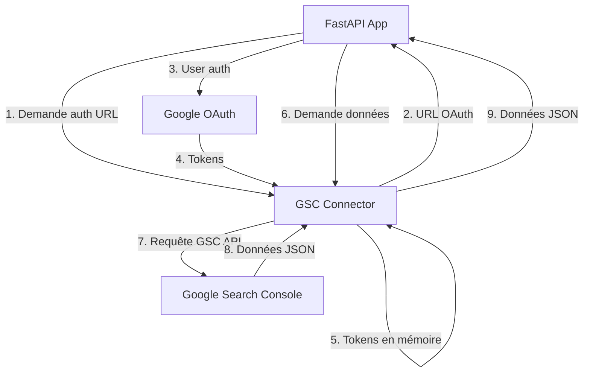

# 🚀 GSC Connector - Mode Stateless (Recommandé)

## 💡 Pourquoi Stateless ?

Vous avez raison ! Pour un simple connecteur qui récupère les données GSC et les transmet à d'autres outils, **pas besoin de base de données**.

### ✅ **Mode Stateless** (recommandé)
- **OAuth tokens** → Stockage temporaire en mémoire
- **Données GSC** → Récupération à la volée 
- **Transmission directe** → Pas de persistance
- **Déploiement simple** → Juste Docker, pas de PostgreSQL/SQLite
- **Performance optimale** → Moins de dépendances

## 🔧 Configuration Stateless

### .env.production
```bash
# Mode stateless - Pas de BDD nécessaire
SKIP_DB_SAVE=true
SKIP_DB_INIT=true
SKIP_REDIS=true

# OAuth Google (seule configuration requise)
GOOGLE_CLIENT_ID=votre_client_id
GOOGLE_CLIENT_SECRET=votre_client_secret
OAUTH_REDIRECT_URI=https://ndd.fr/gsc-connector/auth/callback

# Sécurité
API_KEY=votre_api_key_securisee
ENCRYPTION_KEY=cle_32_caracteres_pour_tokens
```

## 🐍 **Usage depuis FastAPI** (inchangé)

```python
import httpx
from datetime import datetime, timedelta

class GSCClient:
    def __init__(self):
        self.base_url = "https://ndd.fr/gsc-connector"
        self.headers = {"X-API-Key": "votre_api_key"}
    
    async def get_top_keywords_live(self, site, days=30):
        """Récupère les top mots-clés en temps réel depuis GSC"""
        end_date = datetime.now().date()
        start_date = end_date - timedelta(days=days)
        
        # Pas d'import nécessaire - données récupérées à la volée
        async with httpx.AsyncClient(timeout=60) as client:
            response = await client.post(
                f"{self.base_url}/gsc/live-search",
                headers=self.headers,
                json={
                    "property": f"sc-domain:{site}",
                    "startDate": start_date.isoformat(),
                    "endDate": end_date.isoformat(),
                    "dimensions": ["query", "page"],
                    "rowLimit": 100
                }
            )
            return response.json()

# Usage dans vos endpoints FastAPI
@app.get("/keywords/{site}")
async def get_keywords(site: str, days: int = 30):
    client = GSCClient()
    return await client.get_top_keywords_live(site, days)
```

## 📊 **Avantages du Mode Stateless**

### 🚀 **Déploiement ultra-simple**
```bash
# Juste Docker, rien d'autre
docker build -t gsc-connector .
docker run -p 3000:3000 gsc-connector
```

### ⚡ **Performance**
- Pas d'I/O base de données
- Requêtes directes à l'API Google
- Réponses en temps réel

### 🔒 **Sécurité**
- Tokens OAuth en mémoire uniquement
- Pas de données persistées
- Surface d'attaque réduite

### 🛠 **Maintenance**
- Pas de backup de BDD
- Pas de migrations de schema
- Redémarrage = clean state

## 🎯 **Endpoints disponibles**

### 1. **Récupération directe GSC**
```bash
# Propriétés GSC de l'account
GET /gsc-connector/gsc/properties

# Données Search Analytics en temps réel
POST /gsc-connector/gsc/live-search
{
  "property": "sc-domain:agence-slashr.fr",
  "startDate": "2025-07-24",
  "endDate": "2025-08-23",
  "dimensions": ["query", "page"],
  "rowLimit": 100
}
```

### 2. **Authentification (temporaire)**
```bash
# URL d'authentification
GET /gsc-connector/auth/url

# Statut auth (tokens en mémoire)
GET /gsc-connector/auth/status
```

### 3. **Health checks**
```bash
# Santé du service
GET /gsc-connector/health
# Réponse: {"status": "healthy", "mode": "stateless"}

# Service prêt
GET /gsc-connector/ready
# Réponse: {"status": "ready", "message": "Stateless service is ready"}
```

## 🔄 **Workflow recommandé**



## 📝 **Exemple complet FastAPI**

```python
from fastapi import FastAPI
import httpx
from typing import List, Dict

app = FastAPI()
gsc_base = "https://ndd.fr/gsc-connector"
api_key = "votre_api_key"

@app.get("/gsc-auth")
async def get_auth_url():
    """Étape 1: Obtenir l'URL d'authentification"""
    async with httpx.AsyncClient() as client:
        response = await client.get(
            f"{gsc_base}/auth/url",
            headers={"X-API-Key": api_key}
        )
        return response.json()

@app.get("/sites")
async def list_sites():
    """Étape 2: Lister les sites GSC disponibles"""
    async with httpx.AsyncClient() as client:
        response = await client.get(
            f"{gsc_base}/gsc/properties",
            headers={"X-API-Key": api_key}
        )
        return response.json()

@app.get("/keywords/{site}")
async def get_top_keywords(site: str, days: int = 30):
    """Étape 3: Récupérer les top mots-clés"""
    async with httpx.AsyncClient(timeout=60) as client:
        response = await client.post(
            f"{gsc_base}/gsc/live-search",
            headers={"X-API-Key": api_key, "Content-Type": "application/json"},
            json={
                "property": f"sc-domain:{site}",
                "startDate": (datetime.now() - timedelta(days=days)).date().isoformat(),
                "endDate": datetime.now().date().isoformat(),
                "dimensions": ["query"],
                "rowLimit": 50,
                "orderBy": [{"field": "clicks", "sortOrder": "DESCENDING"}]
            }
        )
        return response.json()

# Usage: 
# 1. GET /gsc-auth → Authentifier dans le navigateur
# 2. GET /sites → Voir les sites disponibles  
# 3. GET /keywords/agence-slashr.fr → Top mots-clés
```

---

## ✅ **Résumé**

**Mode Stateless = Solution parfaite pour votre usage !**

- ✅ **Simple** : Pas de BDD à gérer
- ✅ **Rapide** : Données en temps réel
- ✅ **Léger** : Juste Docker
- ✅ **Sûr** : Pas de persistance 

**L'outil devient un simple proxy intelligent entre vos apps et l'API Google Search Console.**